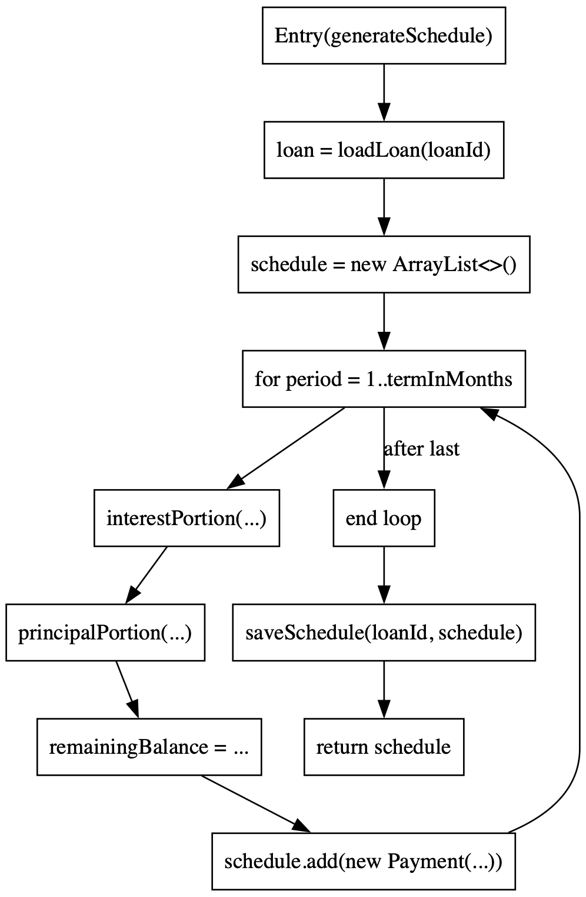
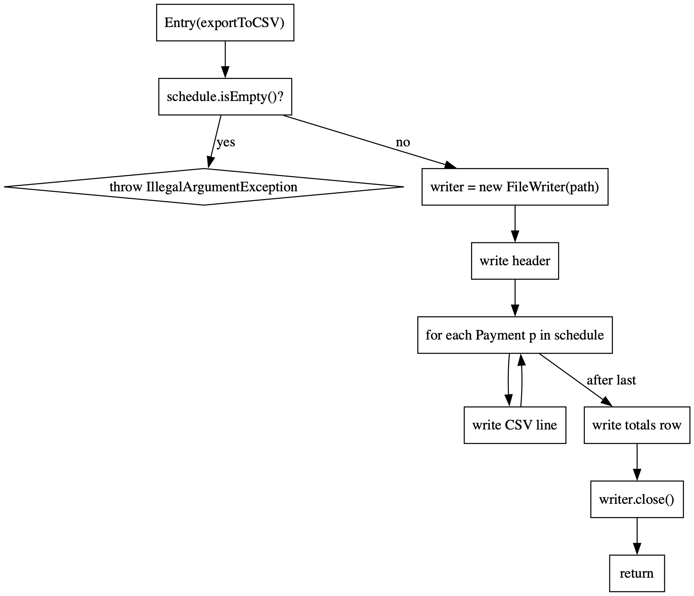

# TESTING.md

## 1. Introduction
This document presents the comprehensive test plan for **LoanEase**, demonstrating fulfillment of all ENSE 375 testing requirements. We apply both structure-based (path, data flow) and specification-based (boundary, equivalence class, decision table, state transition, use case) techniques, alongside integration tests.

## 2. Test Requirements
Per project requirements, the application must be tested as follows:

- **Function-Level (Structure-Based):** Path Testing, Data Flow Testing
- **Integration Testing:** Interactions among a subset of modules
- **Validation (Specification-Based):** Boundary Value Testing, Equivalence Class Testing, Decision Table Testing, State Transition Testing, Use Case Testing

## 3. Structure-Based Testing

### 3.1 Path Testing
**Target Function:** `FinancialCalculator.computePMT(principal, annualRate, termInMonths, frequency)`

#### Control Flow Graph (CFG)


```
  [1] → validate principal > 0? ── no → [2] throw IllegalArgumentException
    │                                  
    → yes → validate rate ≥ 0? ── no → [3] throw IllegalArgumentException
    │                                  
    → yes → validate term > 0? ── no → [4] throw IllegalArgumentException
    │                                  
    → yes → validate frequency == "Monthly"? ── no → [5] throw IllegalArgumentException
    │                                  
    → yes → [6] ratePerPeriod = annualRate / 12
    → [7] ratePerPeriod == 0? ── yes → [8] pmt = principal / termInMonths → [10] return pmt
                            └─ no  → [9] pmt = formula(...) → [10] return pmt
```  

#### Prime Paths & Test Paths
| Prime Path             | Description                | Test Case                                      |
|------------------------|----------------------------|------------------------------------------------|
| [1→2]                  | Negative principal branch  | `testComputePMT_NegativePrincipal()`           |
| [1→3]                  | Negative rate branch       | `testComputePMT_NegativeRate()` (validator)    |
| [1→4]                  | Zero term branch           | `testValidate_ZeroTerm()`                      |
| [1→5]                  | Invalid frequency branch   | `testComputePMT_WeeklyFrequency()`             |
| [1→6→7→8→10]           | Zero-rate formula path     | `testComputePMT_ZeroRate()`                    |
| [1→6→7→9→10]           | Standard formula path      | `testComputePMT_StandardLoan()`                |

All paths are covered by the above JUnit tests.

### 3.2 Data Flow Testing
**Objective:** Verify correct propagation of data through definitions and uses.

#### Def-Use Analysis for `computePMT`
| Node | Statement                          | Defs                           | Uses                       |
|------|------------------------------------|--------------------------------|----------------------------|
| 1    | entry & validation                 | principal, annualRate, termInMonths, frequency | —            |
| 6    | ratePerPeriod = annualRate/12      | ratePerPeriod                  | annualRate                 |
| 7    | compare ratePerPeriod to zero      | —                              | ratePerPeriod              |
| 8    | compute simple PMT                 | pmt                            | principal, termInMonths    |
| 9    | compute formula PMT                | pmt                            | principal, ratePerPeriod, termInMonths |
| 10   | return pmt                         | —                              | pmt                        |

#### DU Pairs & DU Paths
| Variable       | DU Pairs (def→use)       | DU Paths            |
|----------------|--------------------------|---------------------|
| principal      | (1→8), (1→9)             | [1→6→7→8], [1→6→7→9]|
| annualRate     | (1→6)                    | [1→6→7→9]           |
| ratePerPeriod  | (6→7), (6→9)             | [6→7→8], [6→7→9]    |
| termInMonths   | (1→8), (1→9)             | [1→6→7→8], [1→6→7→9]|
| pmt            | (8→10), (9→10)           | [8→10], [9→10]      |

These DU paths are exercised by `testComputePMT_ZeroRate()` and `testComputePMT_StandardLoan()`.

## 4. Integration Testing
**Objective:** Validate interactions among modules: `AmortizationService`, `DatabaseService`, and `ExportUtil`.

### Control Flow for `AmortizationService.generateSchedule`


```
 [A1] entry → load loan from DB (loanId)
 [A2] initialize empty schedule list
 [A3] for period = 1 to termInMonths:
       → [A4] interest = interestPortion(...)
       → [A5] principal = principalPortion(...)
       → [A6] balance = updateBalance(...)
       → [A7] schedule.add(Payment(...))
       ↺ back to [A3] or exit loop →
 [A8] DatabaseService.saveSchedule(loanId, schedule)
 [A9] return schedule
```  

### Control Flow for `ExportUtil.exportToCSV`


```
 [E1] entry(schedule, filePath)
 [E2] if schedule.isEmpty() → throw IllegalArgumentException
 [E3] open FileWriter(filePath)
 [E4] write header
 [E5] for each Payment p in schedule:
       → write CSV line (period, principal, interest, total, balance)
 [E6] write totals row
 [E7] close writer → return
```  

### Coupling DU Pairs
| # | Def (Module.Node)                      | Use (Module.Node)                      |
|---|----------------------------------------|----------------------------------------|
| 1 | `AmortizationService.saveLoan` → loanId| `generateSchedule` uses loanId (A1)    |
| 2 | `generateSchedule` → schedule (A9)     | `exportToCSV` uses schedule (E2, E5)   |

These interactions are covered by:
- `AmortizationServiceTest.testGenerateSchedule_PrincipalFlow()`
- `DatabaseServiceTest.testSaveAndRetrieveLoanAndSchedule()`
- `ExportUtilTest.testIntegrationWithAmortizationService()`

## 5. Specification-Based Testing

### 5.1 Boundary Value Analysis
| Parameter     | Boundary Values          | Test Method                                   |
|---------------|--------------------------|-----------------------------------------------|
| Principal     | -0.01 (invalid), 0.01, 1 000 000 | `testComputePMT_NegativePrincipal()`, `testComputePMT_MaxPrincipal()` |
| Annual Rate   | -0.01 (invalid), 0.00, 1.00 | `testValidate_NegativeRate()`, `testComputePMT_ZeroRate()`            |
| Term (months) | 0 (invalid), 1, 480           | `testValidate_ZeroTerm()`, `testGenerateSchedule_12Months()`         |
| Extra Payment | -0.01 (invalid), 0.00           | `testValidate_NegativeExtraPayment()`                            |
| Schedule size | 0 (invalid), ≥1                 | `testExportToCSV_EmptySchedule()`                                |

### 5.2 Equivalence Class Testing
| Input Domain     | Valid Class               | Invalid Class           | Test Methods                                 |
|------------------|---------------------------|-------------------------|-----------------------------------------------|
| Principal        | >0                        | ≤0                      | `testValidate_ValidInput()`, `testValidate_NegativePrincipal()`    |
| Annual Rate      | ≥0                        | <0                      | `testComputePMT_ZeroRate()`, `testValidate_NegativeRate()`        |
| Term             | >0                        | ≤0                      | `testValidate_ValidInput()`, `testValidate_ZeroTerm()`            |
| Frequency        | "Monthly"               | other strings           | `testValidate_ValidInput()`, `testValidate_InvalidFrequency()`    |
| Extra Payment    | ≥0                        | <0                      | `testValidate_ValidInput()`, `testValidate_NegativeExtraPayment()`|

### 5.3 Decision Table Testing
| # | P>0 | Rate≥0 | Term>0 | Freq=Monthly | Extra≥0 | Outcome | Test Method                        |
|---|-----|--------|--------|--------------|---------|---------|------------------------------------|
| 1 | Y   | Y      | Y      | Y            | Y       | Pass    | `testValidate_ValidInput()`        |
| 2 | N   | Y      | Y      | Y            | Y       | Fail    | `testValidate_NegativePrincipal()` |
| 3 | Y   | N      | Y      | Y            | Y       | Fail    | `testValidate_NegativeRate()`      |
| 4 | Y   | Y      | N      | Y            | Y       | Fail    | `testValidate_ZeroTerm()`          |
| 5 | Y   | Y      | Y      | N            | Y       | Fail    | `testValidate_InvalidFrequency()`  |
| 6 | Y   | Y      | Y      | Y            | N       | Fail    | `testValidate_NegativeExtraPayment()`|
|   |     |        |        |              |         |         |                                      |
| **CSV Variant** |      |        |        |              |         |         | `testExportToCSV_DecisionTable()`  |

### 5.4 State Transition Testing
**Application States:**
- **Start** (awaiting input)
- **Scheduled** (display amortization table)
- **Export Prompt** (ask CSV/PDF)
- **Exit** (terminate)

| Test Case                              | From State    | Action                | To State      | Test Method                         |
|----------------------------------------|---------------|-----------------------|---------------|-------------------------------------|
| Input valid loan parameters            | Start         | valid input sequence  | Scheduled     | `testStart_ValidInput()`            |
| Choose export after schedule           | Scheduled     | press `y` at CSV?     | Export Prompt | `testStart_ExportUseCase()`         |
| Decline CSV, choose PDF                | Export Prompt | press `n`,`y`         | Exit/Export   | `testStart_ExportUseCase()`         |
| Invalid input at start                 | Start         | negative principal    | Start/Error   | `testStart_InvalidInput()`          |

### 5.5 Use Case Testing
| Use Case # | Description                                         | JUnit Test Method                    |
|------------|-----------------------------------------------------|--------------------------------------|
| 1          | Display amortization schedule for valid input       | `testStart_ValidInput()`             |
| 2          | Export schedule to CSV and PDF                     | `testStart_ExportUseCase()`          |
| 3          | Run extra-payment scenario                          | `testStart_ScenarioUseCase()`        |

## 6. Tools & Coverage

- **Framework:** JUnit 5, Maven, JDK
- **Code Coverage:** > 80 % overall (measured via Java Code Runner JUnit Extension Coverage)

### Test Coverage Snapshot


---

## 7. Full Test Listing (28 Test Cases)
Below is a comprehensive list of all JUnit test methods grouped by test class and file, with one-line descriptions:

- **FinancialCalculatorTest.java**
  - **testComputePMT_StandardLoan**: Verifies PMT calculation for a typical loan scenario.  
  - **testComputePMT_ZeroRate**: Ensures zero-interest loans split principal evenly across periods.  
  - **testComputePMT_WeeklyFrequency**: Confirms unsupported weekly frequency throws IllegalArgumentException.  
  - **testComputePMT_NegativePrincipal**: Checks that negative principal input triggers IllegalArgumentException.  
  - **testComputePMT_MaxPrincipal**: Tests PMT result for a very large principal value.  
  - **testComputePMT_DataFlow**: Validates correct interest and principal breakdown for each payment.  
  - **testRoundCurrency**: Ensures monetary values are rounded to two decimal places (HALF_UP).  

- **AmortizationServiceTest.java**
  - **testGenerateSchedule_PrincipalFlow**: Checks total principal paid equals original loan amount.  
  - **testGenerateSchedule_12Months**: Verifies schedule length, first payment amounts, and final balance for a 12-month term.  

- **DatabaseServiceTest.java**
  - **testSaveAndRetrieveLoanAndSchedule**: Validates saving and retrieving loan details and payment schedule from the database.  

- **LoanEaseCLITest.java**
  - **testStart_ValidInput**: Confirms correct display of amortization table for valid CLI input.  
  - **testStart_InvalidInput**: Checks CLI error handling and message for invalid input data.  
  - **testStart_ExportUseCase**: Ensures CSV and PDF export flow is correctly triggered and reported.  
  - **testStart_ScenarioUseCase**: Tests CLI handling of extra-payment scenarios and displays scenario schedule.  
  - **testStart_StateTransition**: Verifies CLI state transitions (input → schedule → export prompts) occur in the expected order.  

- **ExportUtilTest.java**
  - **testExportToCSV_Success**: Asserts successful CSV file creation with correct headers and totals row.  
  - **testExportToCSV_EmptySchedule**: Checks exception thrown when attempting to export an empty schedule.  
  - **testExportToPDF_Success**: Validates PDF file creation and ensures its size is greater than zero.  
  - **testExportToPDF_NullLoan**: Ensures IllegalArgumentException is thrown when loan object is null for PDF export.  
  - **testExportToCSV_DecisionTable**: Tests CSV export across valid, empty, and invalid path scenarios per decision table.  
  - **testIntegrationWithAmortizationService**: Confirms end-to-end CSV export integration with AmortizationService.  

- **LoanInputValidatorTest.java**
  - **testValidate_ValidInput**: Ensures no exception for fully valid loan parameter combinations.  
  - **testValidate_NegativePrincipal**: Checks exception for principal less than or equal to zero.  
  - **testValidate_NegativeRate**: Checks exception for negative interest rate input.  
  - **testValidate_ZeroTerm**: Checks exception thrown for zero term length.  
  - **testValidate_InvalidFrequency**: Checks exception for unsupported payment frequency values.  
  - **testValidate_NegativeExtraPayment**: Checks exception for negative extra payment input.  
  - **testValidate_DecisionTable**: Runs multiple input combinations per decision table and verifies expected outcomes.


## 8. Execution Instructions
### Option 1: Use the Testing Sidebar

1. Click the **Testing** icon (🧪) in the sidebar.
2. You’ll see your test class and test methods listed.
3. Right Click the **loanease** icon and choose 'Run Test with Coverage'.

### Option 2: Right-Click in Code

1. Inside any test method, right-click and choose:
   - **Run Test with coverage** or **Debug Test**

### Option 3: Command line  
1. If you want to use the command line then: 
    ```bash
    mvn test
    ```

   
VSCode will show test results in the **Test Output Panel**.


All outputs are automatically compared to expected results; failures will report mismatches.
